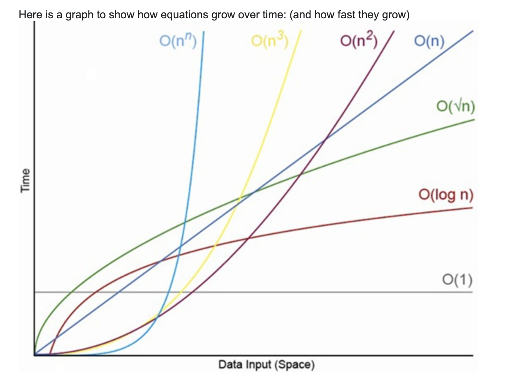

# js-articles

## Babel

### Tutorials

- [Step-by-step guide for writing a custom babel transformation](https://lihautan.com/step-by-step-guide-for-writing-a-babel-transformation/)

- [Creating custom JavaScript syntax with Babel](https://lihautan.com/creating-custom-javascript-syntax-with-babel/)

## Computer Science

- [Sorting Algorithms](https://brilliant.org/wiki/sorting-algorithms/)

- [Sorting Algorithms with Javascript (Part 1)](https://dev.to/wangonya/sorting-algorithms-with-javascript-part-1-4aca)

### Big-Oh

[What is n log n means practically?](https://www.codeproject.com/Questions/500926/Whatplusisplusnpluslogplusnplusmeanspluspracticall)
