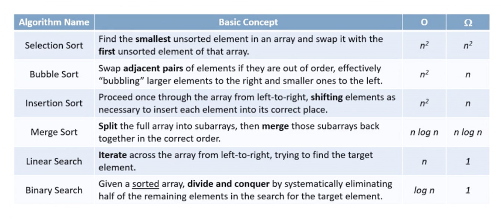

# Learning

## Babel

### Tutorials

- [Step-by-step guide for writing a custom babel transformation](https://lihautan.com/step-by-step-guide-for-writing-a-babel-transformation/)

- [Creating custom JavaScript syntax with Babel](https://lihautan.com/creating-custom-javascript-syntax-with-babel/)

## Computer Science

- [Sorting Algorithms](https://brilliant.org/wiki/sorting-algorithms/)

- [Sorting Algorithms with Javascript (Part 1)](https://dev.to/wangonya/sorting-algorithms-with-javascript-part-1-4aca)

### Algorithms summary

### Big-Oh

[What is n log n means practically?](https://www.codeproject.com/Questions/500926/Whatplusisplusnpluslogplusnplusmeanspluspracticall)
[Understanding Big-O Notation With JavaScript](https://dev.to/b0nbon1/understanding-big-o-notation-with-javascript-25mc?fbclid=IwAR2V9VP8rnQfLoowOmRvMlRpFVV4TrJIC6hIMLXQxWAerSv9K3Va3bkZPa8)

## JavaSctipt

[Event Bubbling in Javascript](https://medium.com/@svsh227/event-bubbling-in-javascript-a-better-understanding-9c7e0096a7e9)
[Event Delegation in JavaScript](https://medium.com/better-programming/event-delegation-in-javascript-boost-your-app-performance-5f10f25cec96)
[Learning JavaScript by building a UI framework from scratch](https://dev.to/carlmungazi/learning-javascript-by-building-a-ui-framework-from-scratch-1767)
[Turning `class App extends React.Component` into a coding lesson](https://dev.to/carlmungazi/turning-class-app-extends-react-component-into-a-coding-lesson-3mod)
[Part 1/3 - Beginners guide to Custom React Renderers. How to build your own renderer from scratch?](https://blog.atulr.com/react-custom-renderer-1/)

## General

[How to do a code review](https://google.github.io/eng-practices/review/reviewer/)
[Giving better code reviews](https://medium.com/@mrjoelkemp/giving-better-code-reviews-16109e0fdd36)
